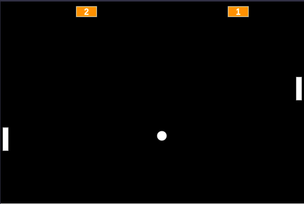

Pong - jogo de Atari

Projeto desenvolvido no curso de programação da Alura para simular o primeiro jogo lançado pela Atari

# Pong

O Pong é um Game que simula o jogo original lançado pela Atari de <a href="https://www.youtube.com/watch?v=fiShX2pTz9A">PingPong</a> na década de 70.

## ✔️ Técnicas e tecnologias utilizadas

Se liga nessa lista de tudo que usamos nesse projeto:

- `Javascript`
- `Bibliotecas P5 : collide2d, draw, preload, setup, loadSound`
- `Editor p5js: https://editor.p5js.org/`
- `Eventos do Teclado`
- `GitHub`

E muito mais!

## 🛠️ Abrir e rodar o projeto

Para abrir e rodar o projeto, instale a extensão Live Server no VS Code e clicar com o botão direito do mouse na `index.html` para inicar o projeto com o Open Live Server.

Depois, o navegador abrirá sozinho no endereço da aplicação rodando o jogo em <a href="http://localhost:5500/">http://localhost:5500/</a>.

Ou experimente online <a href="https://editor.p5js.org/devdesignerstudio/full/k_aRHx6_S"><strong>Aqui</strong></a>

## 🏓 Como jogar ?

Para o <strong>player 1</strong> (raquete a esquerda) utilize as teclas <strong>'W'</strong> para mover para cima e <strong>'S'</strong> para mover para baixo. Para o <strong>player 2</strong> (raquete a direita) utilize as teclas ⬆️ para mover para cima e ⬇️ para mover para baixo.
Bom jogo ! =)

Cada vez que a bolinha bate na borda lateral esquerda o adversário do lado direito marca 1 (um) ponto e vice-versa.

## 📚 Mais informações do curso

O Pong é um jogo para relembrar o sucesso da Atari Games utilizada nesse curso da Alura.

A ideia principal desse curso é evoluir ainda mais os conhecimentos em Javascript e seus fundamentos de forma agradável trazendo o cenário dos games.
